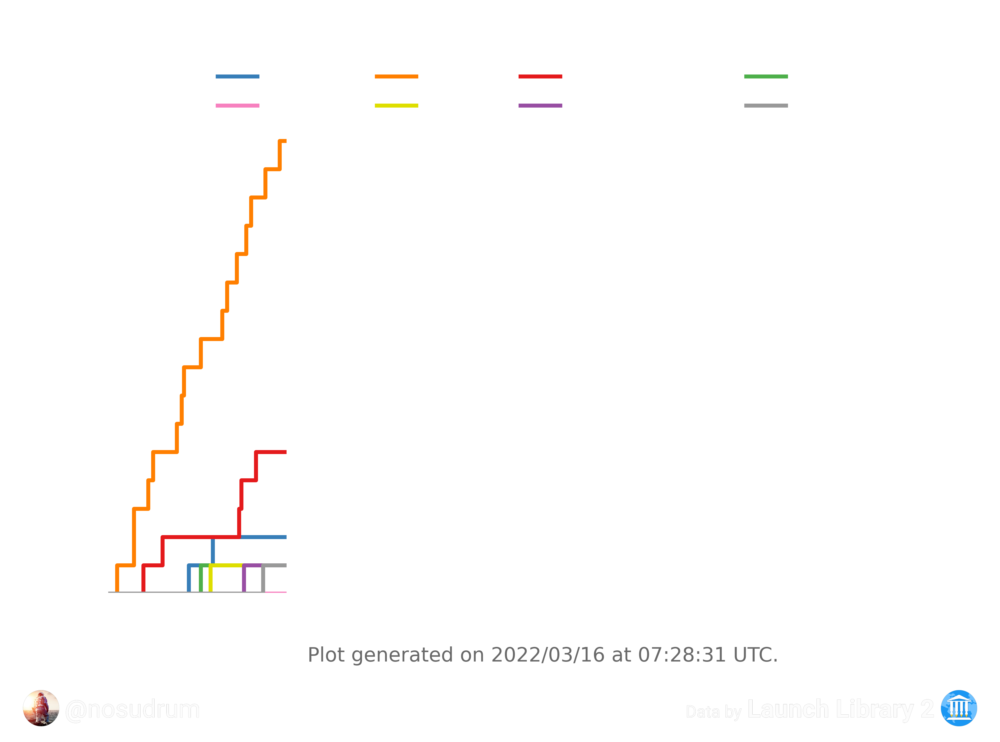
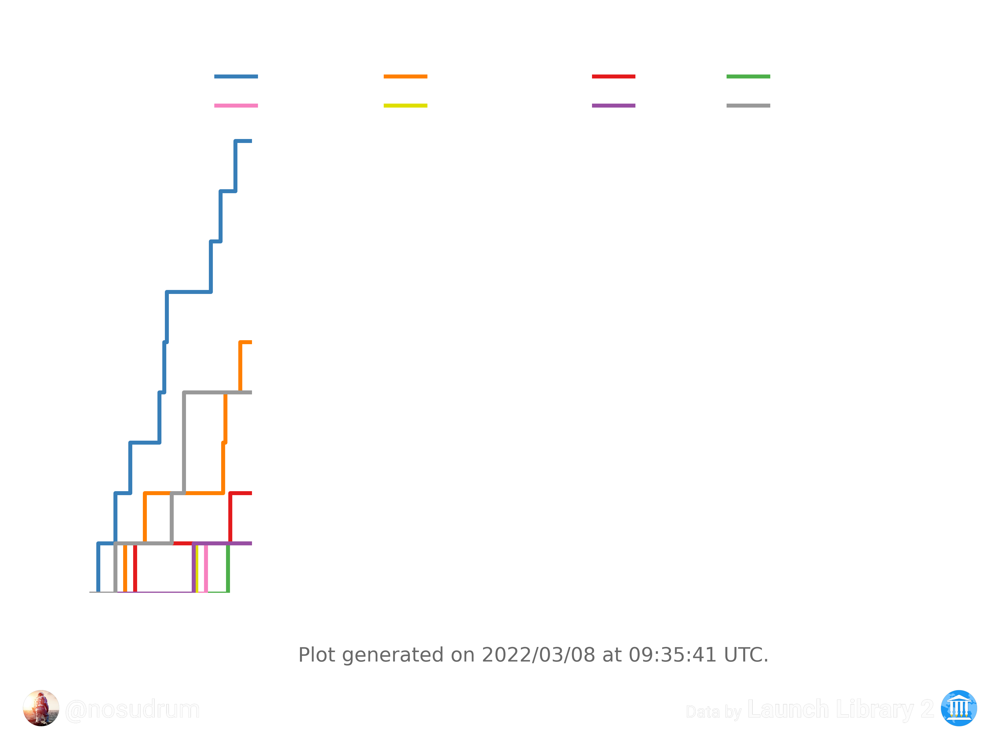
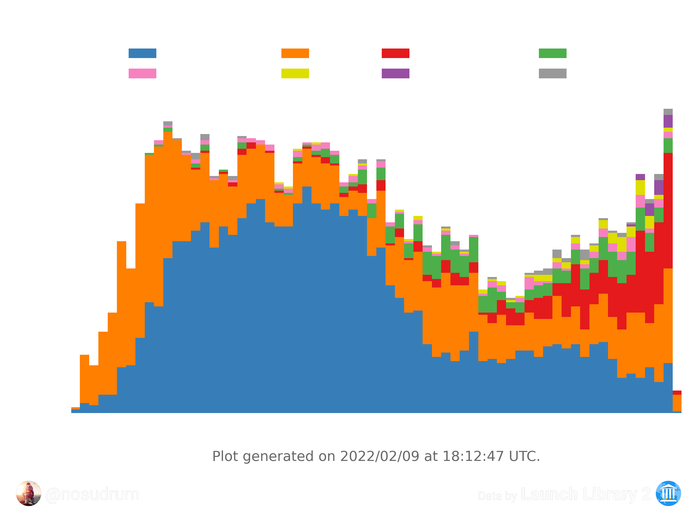
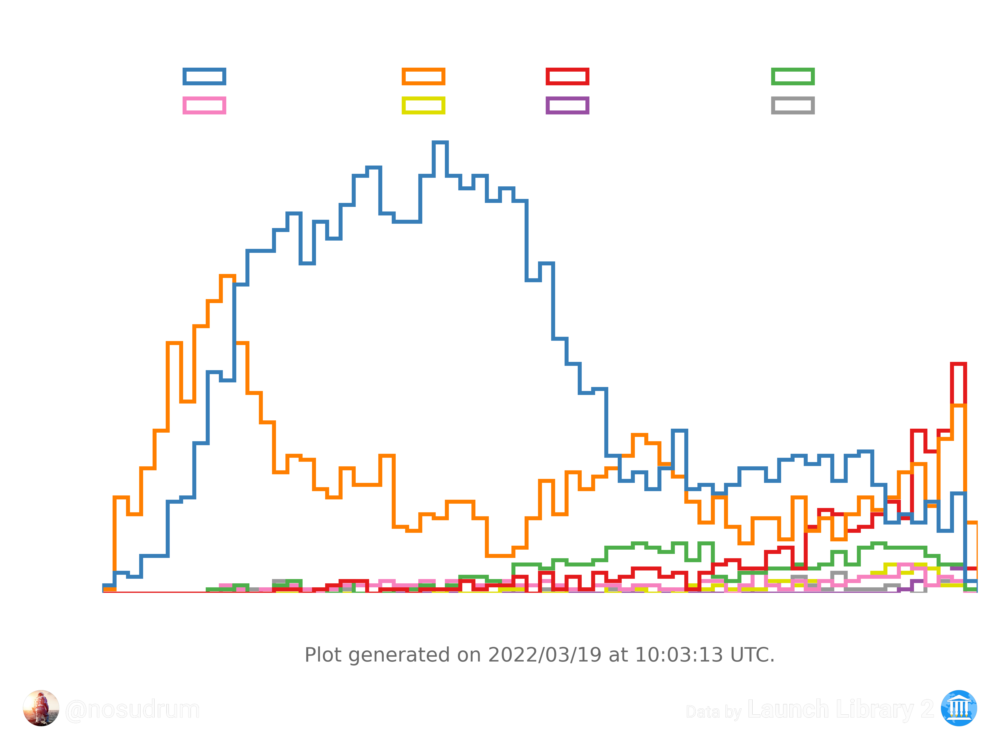

# 🚀 Nosu's LL2 Launch Stats
In this repository you will find various plots related to space launches made using the <a href="https://thespacedevs.com/llapi">Launch Library 2 API</a> and scripts written in [python](python). The [MATLAB](matlab) scripts are no longer used, but are still visible if anyone is interested.

If you have feedback or ideas, feel free to open an issue 🙂

## 🔁 Yearly plots

### 📈 All yearly plots since 1957

🔗 [Yearly plots per country](python/plots/yearly/orbitalAttemptsPerCountry/README.md)

🔗 [Yearly plots per LSP](python/plots/yearly/orbitalAttemptsPerLSP/README.md)

### ⌚ 2022 plots

  
  

## 🏛️ Historical data plots

🔗 [All historical plots](python/plots)

  
  

