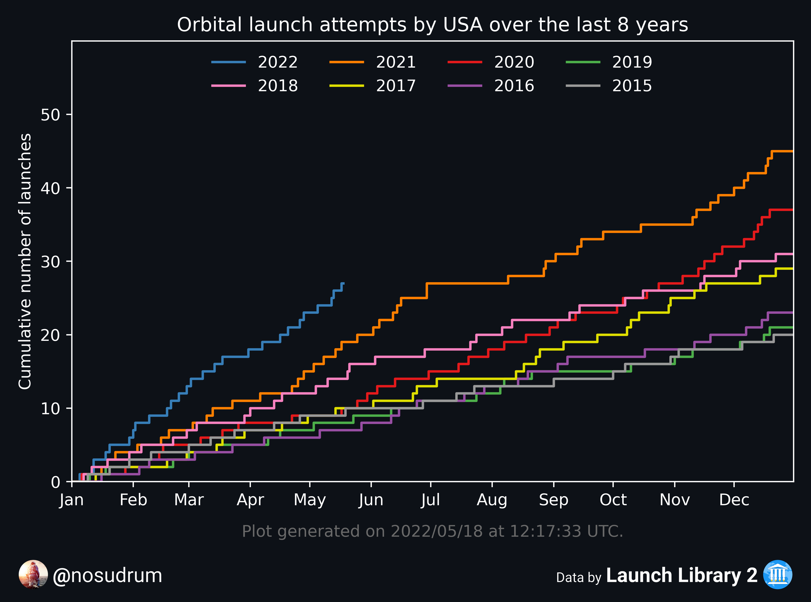
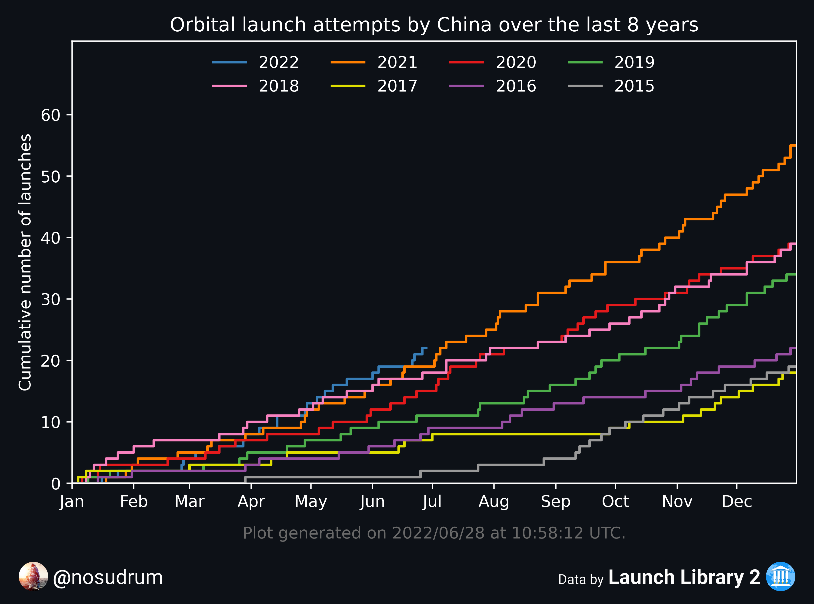
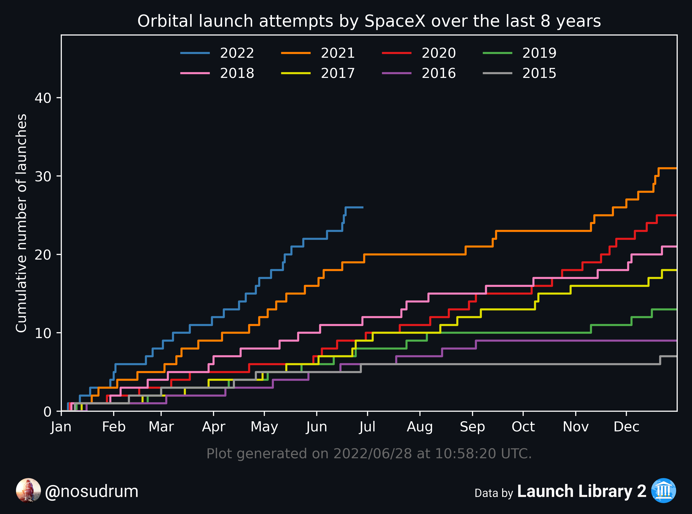
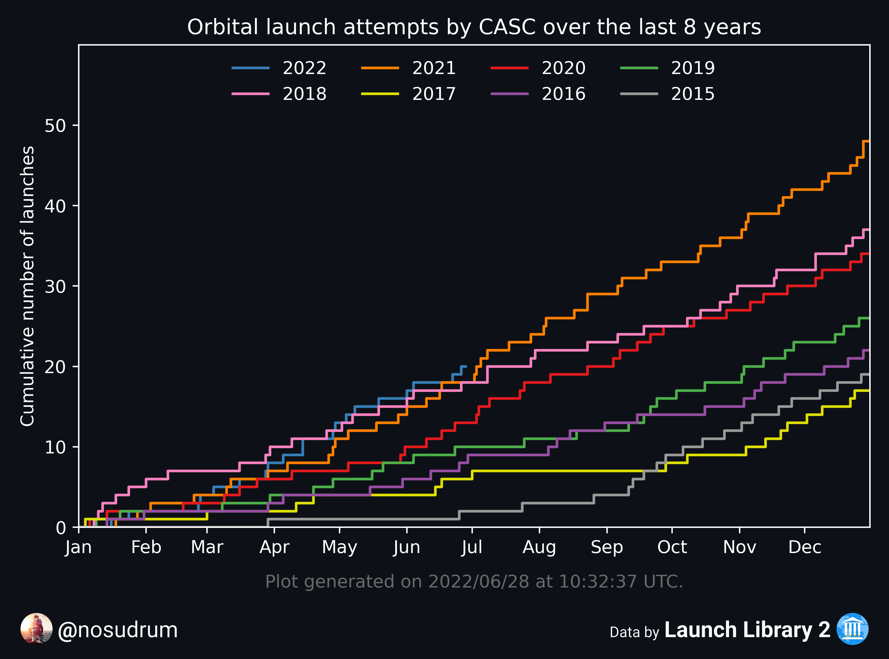

# 🚀 Nosu's LL2 Launch Stats

In this repository you can find various plots related to space launches made using the <a href="https://thespacedevs.com/llapi">Launch Library 2 API</a> and scripts written in [python](python). The old [MATLAB](matlab) scripts are no longer used, but are still visible if anyone is interested.

If you have feedback or ideas, feel free to open an issue. 🙂

## 🔁 Yearly plots

### 📈 All yearly plots since 1957

🔗 [Yearly plots per country](python/plots/yearly/orbitalAttemptsPerCountry/README.md)

🔗 [Yearly plots per LSP](python/plots/yearly/orbitalAttemptsPerLSP/README.md)

### ⌚ 2022 plots

 

## 🏛️ Historical data plots

🔗 [All historical plots](python/plots)

 

## 📈 Launch cadence evolution

🔗 [All country launch cadence plots](python/plots/byCountry/README.md)

🔗 [All LSP launch cadence plots](python/plots/byLSP/README.md)

 

 

## 📈 Day-of-year plots

 

